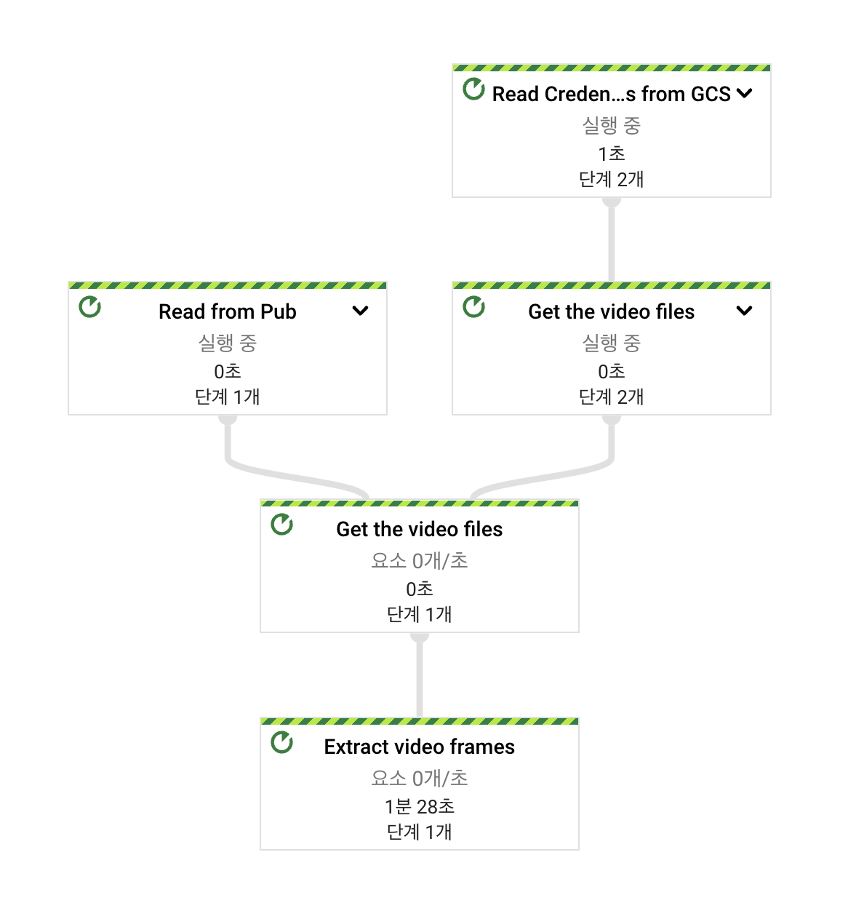

# GCP Vision Dataset Infrastructure Sample

## 개요


### [관련 기사 보기](https://taehun.github.io/mlops/2022/07/09/prepare-vision-data.html)
## 사전 요구사항

- GCP 프로젝트가 생성되어 있어야 합니다. [프로젝트 만들기 및 관리](https://cloud.google.com/resource-manager/docs/creating-managing-projects?hl=ko) 문서를 참고하세요.
- `gloud` CLI를 설치해야 합니다. [gcloud CLI 설치](https://cloud.google.com/sdk/docs/install?hl=ko) 문서를 참고하세요.
- `소유자` 권한을 가진 서비스 계정이 있어야 합니다. [서비스 계정 생성 및 관리](https://cloud.google.com/iam/docs/creating-managing-service-accounts?hl=ko) 문서를 참고하세요.
- 서비스 계정의 키가 필요합니다. [서비스 계정 키 생성 및 관리](https://cloud.google.com/iam/docs/creating-managing-service-account-keys?hl=ko) 문서를 참고하세요.

## 인프라 생성

1. `Terraform` CLI를 설치합니다.

* Terrafrom CLI 설치 (Mac 환경)

```bash
brew tap hashicorp/tap
```

```bash
brew install hashicorp/tap/terraform
```

리눅스와 윈도우 환경에서 설치 방법은 [Install Terraform](https://learn.hashicorp.com/tutorials/terraform/install-cli) 문서를 참고하세요.

2. 서비스 계정의 키 JSON 파일을 다운로드 합니다.

3. Terraform으로 인프라 생성에 필요한 환경 변수를 설정 합니다.

```bash
export TF_VAR_project_id=<YOUR_GCP_PROJECT_ID>
```

```bash
export TF_VAR_google_credentials=`cat <YOUR_SERVICE_ACCOUNT_KEY_FILE.json>`
```

4. `./infra` 폴더에서 terraform으로 인프라를 생성합니다.

```bash
$ cd infra
$ terraform init
$ terraform validate
$ terraform plan

(...)

$ terraform apply

(...)

Do you want to perform these actions?
  Terraform will perform the actions described above.
  Only 'yes' will be accepted to approve.

  Enter a value: yes
```

## 생성되는 GCP 리소스

- GCS 버킷
  - `<PROJECT_ID>-dataset`
  - `<PROJECT_ID>-temp`
- API 활성화
  - Dataflow API
  - Cloud Functions API
  - Pub/Sub API
  - Google Cloud Firestore API
  - BigQuery API

## Dataflow

커스텀 컨테이너 이미지 빌드
```bash
$ cd dataflow
$ export PROJECT=<YOUR_GCP_PROJET_ID>
$ export REPO=<GCR_REPO>
$ export TAG=<TAG>
$ export IMAGE_URI=gcr.io/$PROJECT/$REPO:$TAG
$ gcloud builds submit . --tag $IMAGE_URI
```

Dataflow 실행
```bash
$ pip install 'apache-beam[gcp]'
$ python extract_frames_pipeline.py \
    --input_topic <Pub/Sub TOPIC NAME> \
    --video_path <VIDEO_FILE_GCS_PATH> \
    --image_path <IMAGE_FILE_GCS_PATH> \
    --project <YOUR_PROJECT_ID> \
    --region asia-northeast3 \
    --temp_location=<TEMP_GCS_PATH> \
    --runner=DataflowRunner \
    --experiments=use_runner_v2 \
    --sdk_container_image=gcr.io/$PROJECT/$REPO:$TAG \
    --key_file <SERVICE_ACCOUNT_FILE_GCS_PATH>
```

GCP 콘솔에서 `Dataflow` -> `작업` 메뉴를 확인하면, 스트리밍 유형의 작업이 생성되어 있습니다. 해당 작업을 선택하면, 아래 그림과 같은 데이터 파이프인을 확인 할 수 있습니다.



## Cloud Function

1. GCP 콘솔에서 `Cloud Funcitons` 메뉴를 선택합니다.
2. 구성
  - 함수 이름: `request-labeling`
  - 리전: `asia-northeast3`
  - 트리거: `Cloud Pub/Sub`, `<생성된 Pub/Sub Topic>`
  - 런타임 환경 변수
    - `BUCKET`: `<프레임 이미지 파일 GCS 버킷>`
    - `IMAGE_PATH`: `<버킷내 이미지 파일의 경로>`
3. 코드
  - 런타임: `Python 3.8`
  - 진입점: `request_labeling`
  - 소스 코드를 `function/main.py` 내용으로 복사 & 붙여넣기 합니다.

> 라벨링 요청 루틴은 각 라벨링 회사 및 내부 시스템에 따라 다르므로 구현되어 있지 않습니다.

## 리소스 정리하기

> **NOTE**: GCS 버킷내 파일이 있으면 버킷 삭제가 되지 않습니다. 버킷내 파일을 모두 삭제한 후 실행해 주세요.

```bash
$ cd infra
$ terraform destroy
```